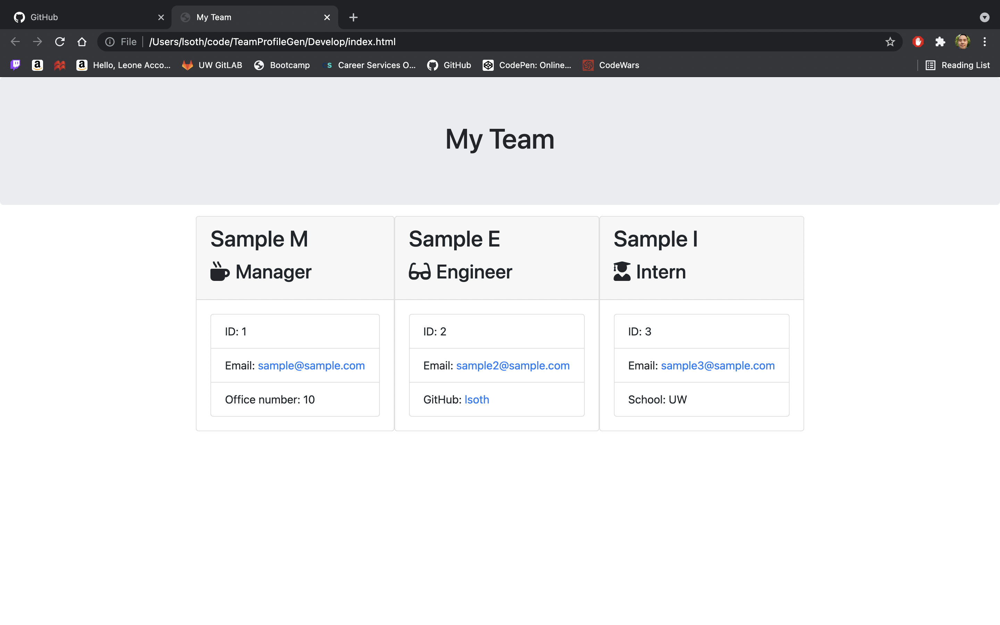

# TeamProfileGen

## Description

The goal of this project was to make a team profile generator application that can build cards with employee information and what roles they do. Depending on whether someone was a manager, intern, or engineer there were different inquirer prompts to answer and an HTML was generated with cards that contained that pertaining info. 

## Installation

This application is in the command terminal, it requires a few node libraries including Jest, fs, and util. To start the application please open index.js in terminal and type node index.js.

## Usage

Here is a demo video: https://youtu.be/UUnBWNEcZqs

As well as a screenshot of what the generator looks like:

## Credits

For this project I referenced in class work and the docs for module exports and fs. 